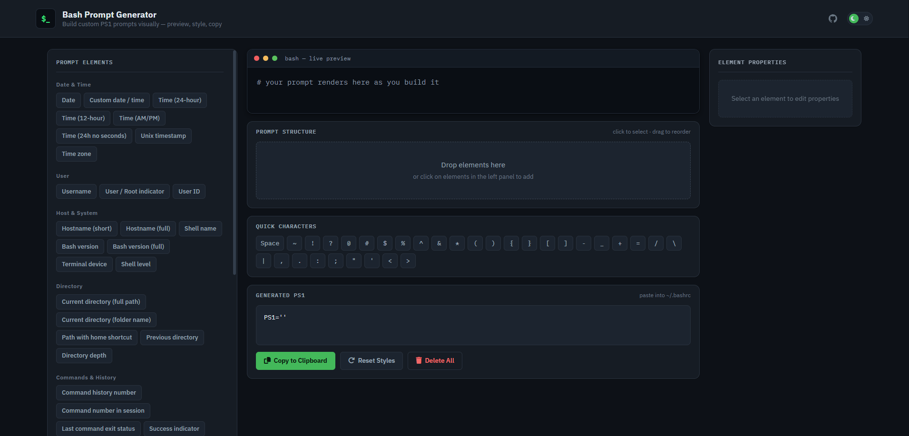

# Bash Prompt Generator

[](https://neikiri.dev/bash-prompt-generator/)
[](https://neikiri.dev/bash-prompt-generator/)

An interactive **Bash PS1 prompt generator** and **Linux prompt builder**. Create custom terminal prompts with colors, Git branch, system info, and formatting—no installation needed. Use the visual canvas to build your prompt and get ready-to-copy code for `~/.bashrc`.

**Keywords:** bash prompt generator · PS1 generator · custom bash prompt · terminal prompt builder · Linux prompt



**Live version:** [https://neikiri.dev/bash-prompt-generator/](https://neikiri.dev/bash-prompt-generator/)

---

## Why use a Bash Prompt Generator?

Tired of the plain `$` in your terminal? Want to see your Git branch, current path, or system info at a glance? This tool lets you visually build a custom PS1 prompt—no need to memorize escape codes or edit `.bashrc` by hand. Add elements, set colors, and copy the result.

---

## Bash Prompt Generator Features

The app lets you build a PS1 prompt by adding building blocks (date, user, path, Git branch, etc.) to a canvas, style them with colors and text attributes, and get the final `PS1="..."` string for your `~/.bashrc`. It works on desktop (with drag-and-drop and multi-select) and on mobile (tap to add, full-screen properties panel). Below is a detailed breakdown.

### Left panel – Prompt Elements

- **Element categories** – add any of these to your prompt:
  - **Date & Time** – date, time (24h/12h), timezone, Unix timestamp
  - **User** – username, root indicator ($/#), UID
  - **Host & System** – hostname (short/full), shell, Bash version, shell level
  - **Directory** – current directory (full path or name), home shortcut (~), depth
  - **Commands & History** – command number, exit status, success/error indicator
  - **Processes** – background jobs count, PID, process count
  - **Version Control** – Git branch, commit hash, repo name, clean/dirty status, staged count
  - **Development Environments** – Python venv, Node/Ruby/Go version, Docker/Kubernetes context
  - **System Status** – CPU/memory/disk usage, load average, uptime
  - **Network** – local/public IP, SSH indicator, network interface
  - **Layout** – newline, carriage return, space, tab
  - **Characters** – bell, escape, backslash, pipe
  - **Icons / Symbols** – Git, folder, user, host, time, success/error icons

- **Quick Characters** – one-tap insertion of special characters (space, ~, !, ?, @, #, $, %, …).

### Center – Canvas and output

- **Canvas** – area where you arrange prompt building blocks in the order they should appear.
- **Preview** – live preview of the prompt (with sample values).
- **Prompt Code** – generated `PS1="..."` string ready to paste into `.bashrc`.
- **Buttons:**
  - **Copy to Clipboard** – copies the Prompt Code.
  - **Reset All** – resets **all element properties** (foreground/background colors and text attributes) to defaults for every element on the canvas. Elements and their order are kept; only styling is cleared.
  - **Delete All** – removes all elements from the canvas (with confirmation).

### Right panel – Element Properties

When one or more elements on the canvas are selected:

- **Colors** – foreground and background (hex/ANSI/Truecolor).
- **Text attributes** – Bold, Dim, Italic, Underline, Blink, Inverted.
- **Actions** – **Duplicate** (duplicate selected elements), **Delete** (remove selected). Changes apply to all selected elements at once.

### Desktop (PC) behaviour

- **Drag & drop** – drag items from Prompt Elements onto the canvas; you can drop **between** existing elements (top/bottom half of an element sets insert position).
- **Multi-select** – click elements on the canvas to add/remove them from the selection; edit properties for all selected at once.
- **Reordering** – drag elements on the canvas to reorder (Sortable).

### Mobile behaviour

- **Adding** – tap elements in Prompt Elements to add them (no drag & drop).
- **Element Properties** – when opened, the panel goes **full screen** (full viewport).
- **Single selection** – one tap selects one element.

### Other

- Each element on the canvas has its **own instance** – you can have several of the same type (e.g. three "Date") and select/edit them separately.
- Empty prompt shows `PS1=""`; with elements, only the content inside the quotes is generated.

---

## How to Use the Bash Prompt Generator

1. Open [https://neikiri.dev/bash-prompt-generator/](https://neikiri.dev/bash-prompt-generator/).
2. **Add elements**  
   - **Desktop:** click an element in the left panel, or **drag** it onto the canvas (or between two existing elements).  
   - **Mobile:** tap elements in **Prompt Elements** (at the top).
3. **Reorder** – on desktop, drag elements on the canvas to change order.
4. **Style** – click/tap an element (or on desktop select several); in **Element Properties** set colors and attributes. Changes apply to all selected.
5. **Duplicate or remove** – use **Duplicate** or **Delete** in Element Properties for the selection; or use the per-element delete icon on the canvas.
6. **Reset styling only** – use **Reset All** to set all elements' colors and attributes back to defaults (elements and order stay).
7. **Copy the code** – in **Prompt Code**, click **Copy to Clipboard**, then in `~/.bashrc` add:
   ```bash
   PS1="your_generated_string"
   ```
   Run `source ~/.bashrc` or reopen the terminal.

---

## FAQ

**What is a Bash prompt (PS1)?**  
The Bash prompt (PS1) is the text shown before each command in a Linux/Unix terminal (e.g. `user@host:~$`). You can customize it to show date, Git branch, current directory, and more.

**How do I add Git branch to my Bash prompt?**  
Use this generator: add the "Git branch" element from the Version Control category, style it if you want, then copy the generated code into your `~/.bashrc` and run `source ~/.bashrc`.

**Is this tool free?**  
Yes. It runs entirely in your browser at [neikiri.dev/bash-prompt-generator](https://neikiri.dev/bash-prompt-generator/). No signup or installation required.

**Does it work offline?**  
No. The page must be loaded once from the web. After that, most editing works without a connection, but initial load requires internet.

---

## Tech

- Plain HTML/CSS/JavaScript (single page, no build).
- [Sortable.js](https://sortablejs.github.io/Sortable/) for drag-and-drop reordering on the canvas.
- [Font Awesome](https://fontawesome.com/) for icons.
- Responsive layout with full-screen Element Properties on mobile.

---

## Author

© 2026 [neiki](https://neikiri.dev/) · neikiri@neikiri.cz

---

## Related searches

bash ps1 generator · custom terminal prompt · linux prompt builder · ps1 with colors · git branch in prompt · bash prompt customization · terminal prompt customization · PS1 escape sequences
